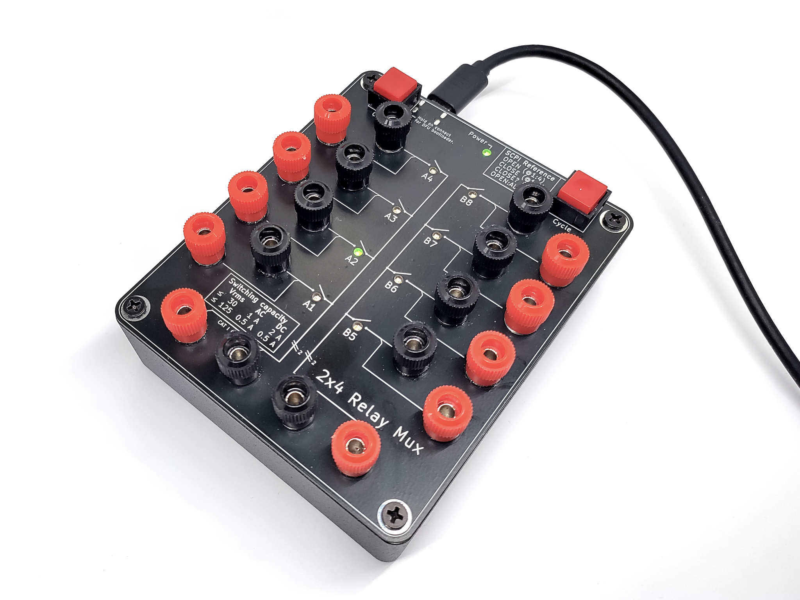

# USB Relay Mux box

This repository contains hardware and firmware for a USB Relay Mux that has two independent halves,
each of which multiplexes a pair of signals to four channels. It is designed for use in automatic
testing, for example to switch input signals to multimeter or to change polarity of a power supply.

[**Schematic**](pcb/images/relaymux.pdf) - [**BOM**](pcb/gerbers/bom-generic.csv) - [**Gerbers**](pcb/gerbers/)

## Design

Many of the cheap USB relay boards are designed for switching large currents, and not for lab usage.
They have several shortcomings:

* Poor quality relays, which have varying amount of resistance when switching small currents.
* Weird custom protocol with no feedback from device.
* Excessive current draw from USB bus when all relays are activated.

This project implements the standard SCPI command set and uses higher quality [Panasonic TQ2SA-5V](https://na.industrial.panasonic.com/products/relays-contactors/mechanical-signal-relays/lineup/signal-relays/series/119572/model/119942) relays.

## Specifications

* Switching time: 10 ms
* Maximum current and voltage:
  * up to 30 Vrms: AC 1 A or DC 2 A
  * up to 125 Vrms: AC or DC 0.5 A
* Parasitic capacitance: 40 pF each signal to GND
* Wetting current: 10 µA
* Contact resistance: 50 mohm typical, max 150 mohm
* Power supply: USB 5V 300mA
* Control: SCPI over USB CDC-ACM serial port

## SCPI command set

* `*IDN?`: Query model name and serial number
* `OPEN @(1,2,5:8)`: Open (disconnect) one or multiple relay channels
* `CLOSE @(1,5)`: Close (connect) one or multiple relay channels
* `CLOSE? (@1)`: Query whether a specific channel is closed
* `CLOSE:STATE?`: Return a list of all closed channels
* `OPEN:ALL`: Open all channels
* `SET 255`: Set channel states as 8-bit integer, break-before-make
* `SET:MBB 255`: Set channel states as 8-bit integer, make-before-break
* `GET?`: Get channel states as 8-bit integer

The commands follow "Signal Switchers" instrument category of SCPI 1999 standard.

All commands wait for relay switching, so consecutive instructions will follow correct make/break sequencing.

## Parts

| Part            | Info                            | Approx. cost (without taxes) |
|-----------------|---------------------------------|--------------|
| PCB             | 120x100 mm, [gerbers](pcb/gerbers) | 8 EUR     |
| Components      | [Listed in BOM](pcb/gerbers/bom-generic.csv) | 18 EUR |
| Binding posts   | 20 pcs, 5 mm mounting hole | 10 EUR |
| Enclosure       | Hammond [1550MBK](https://www.hammfg.com/part/1550MBK) | 15 EUR |
| **Total**           | | **51 EUR**|

The PCB is designed for mounting the binding posts directly with a nut to the 5 mm hole.
How well this works depends on the specific connector model.
If needed, the hole can be drilled larger without damage to the traces, and a soldering
area is provided in case there is no electrical contact through the screw.
Some solder is a good idea in any case to prevent it from the connector spinning in the hole.
Cheapest binding posts can be found on eBay, but some of them lack a hole for a wire.

The PCB replaces the original lid of the enclosure. A small notch needs to be filed for the USB-C connector to fit through.

## Firmware

STM32F042 firmware is based on STM32Cube USB-CDC library and [scpi-parser](https://github.com/j123b567/scpi-parser) library.

It can be built using [PlatformIO](https://platformio.org):

    pio run
    ...
    RAM:   [=====     ]  52.5% (used 3224 bytes from 6144 bytes)
    Flash: [========  ]  80.3% (used 26300 bytes from 32768 bytes)

The board can be programmed through USB DFU protocol using STM32 built-in bootloader.
The bootloader is activated by holding down `Clear` button while plugging in the cable.

## License

The electronics design is licensed under [CC-BY-4.0](https://creativecommons.org/licenses/by/4.0/deed.fi).
Suggested attribution format for derivative designs:

    Based on USB Relay Mux by Petteri Aimonen, https://github.com/PetteriAimonen/relaymux/

The firmware is licensed under [BSD 2-Clause license](LICENSE).
